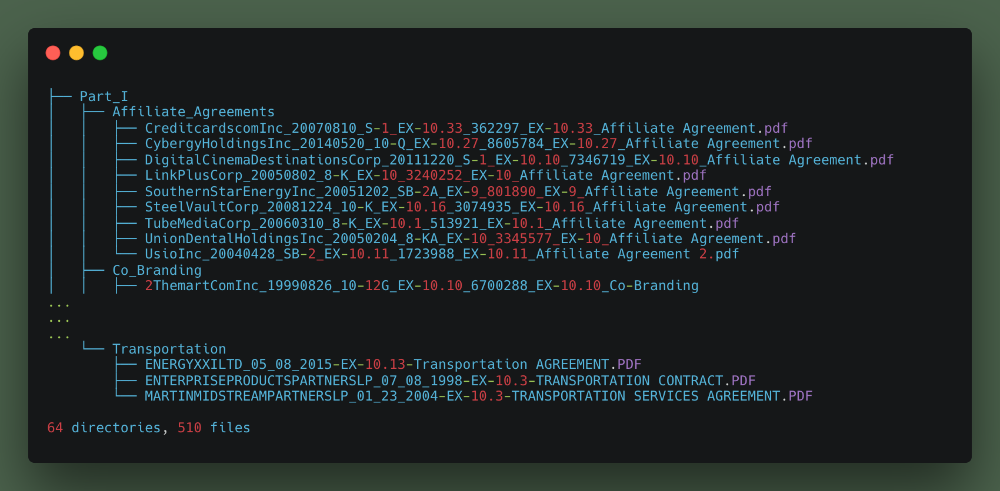
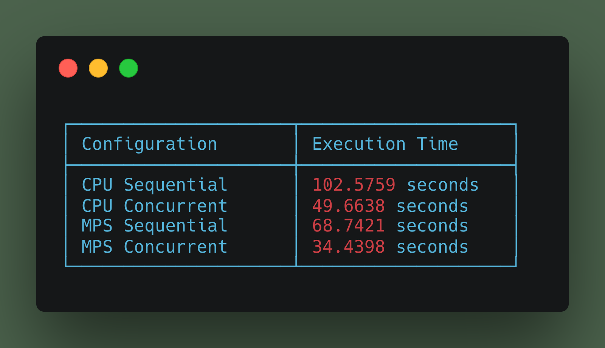
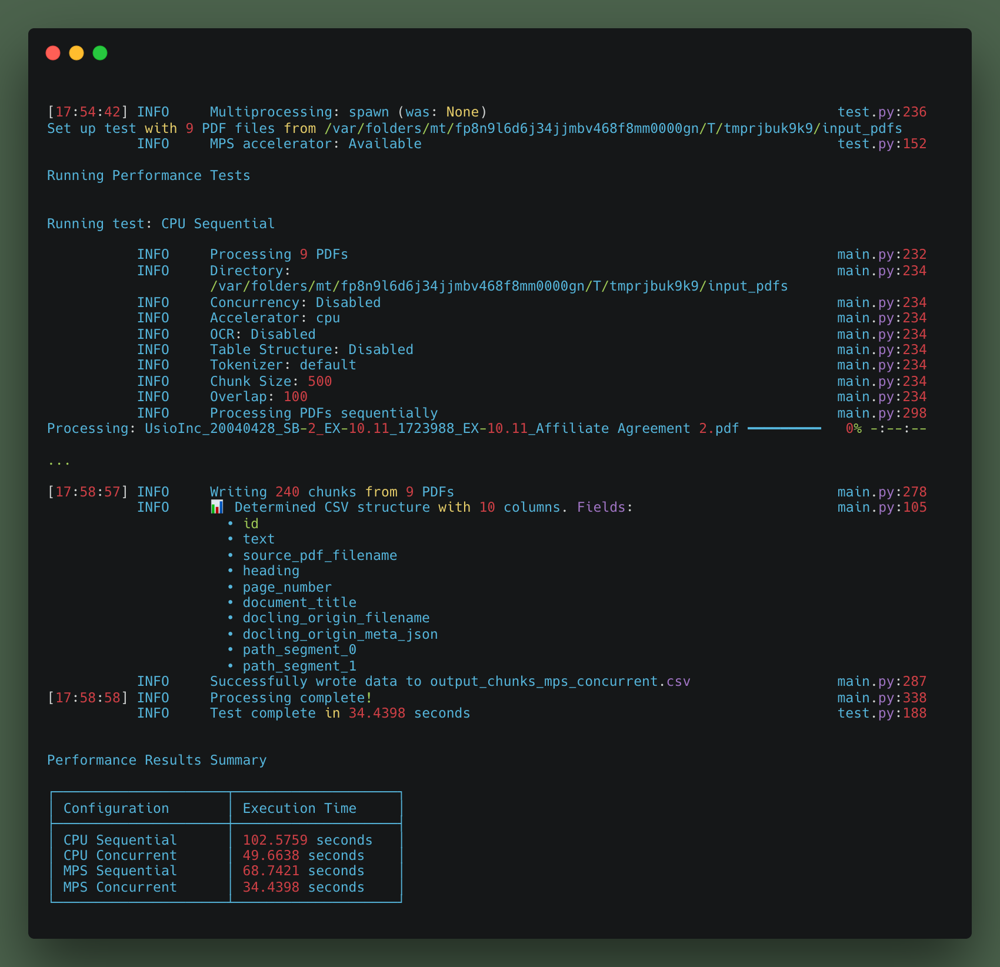

# docunomic


Document processing for Nomic

## Demo

Download [CUAD_v1](https://pub-2f787ac515f74bafa6b547f8bcd01f11.r2.dev) (demo PDF dataset, sourced from [Kaggle](https://www.kaggle.com/datasets/konradb/atticus-open-contract-dataset-aok-beta))  and unzip it in the `data/` directory.

#### How do you get this data into Atlas?



#### Run docunomic!

```bash
uv run main.py data/CUAD_v1/full_contract_pdf cuad.csv
```

This produces a CSV ready for Atlas

<small>

| id | text | source_pdf_filename | heading | page_number | document_title | part | category | docling_origin_filename |
|-----|------|-------------------|---------|-------------|----------------|------|----------|------------------------|
| OLDAPIWIND-DOWNLTD_01_08_2016-EX-1.3-A... | May 21, 2015 Tribute Pharmaceutica... | OLDAPIWIND-DOWNLTD_01_08_2016-EX-1.3-A... | | 1 | OLDAPIWIND-DOWNLTD_01_08_2016-EX-1.3-A... | Part_II | Agency Agreements | OLDAPIWIND-DOWNLTD_01_08_2016-EX-1.3-A... |
| OLDAPIWIND-DOWNLTD_01_08_2016-EX-1.3-A... | Dear Mr. Harris: The undersigned, Du... | OLDAPIWIND-DOWNLTD_01_08_2016-EX-1.3-A... | Attention: Rob Harris, President and Chief Executive Officer| 1| OLDAPIWIND-DOWNLTD_01_08_2016-EX-1.3-A... | Part_II | Agency Agreements | OLDAPIWIND-DOWNLTD_01_08_2016-EX-1.3-A... |
...

</small>

## Diagnostic test

This test processes the 9 pdfs in `CUAD_v1/full_contract_pdf/Part_1/Affiliate_Agreements/` to test hardware and processing configuration on your machine

```bash
uv run test.py

```
Results on my nomic macbook m3 16gb:



